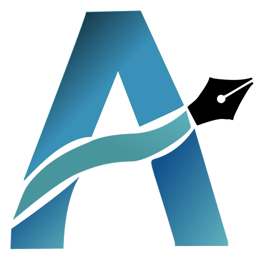
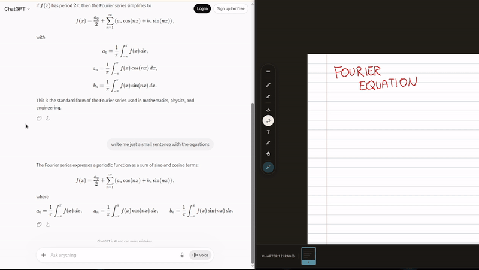
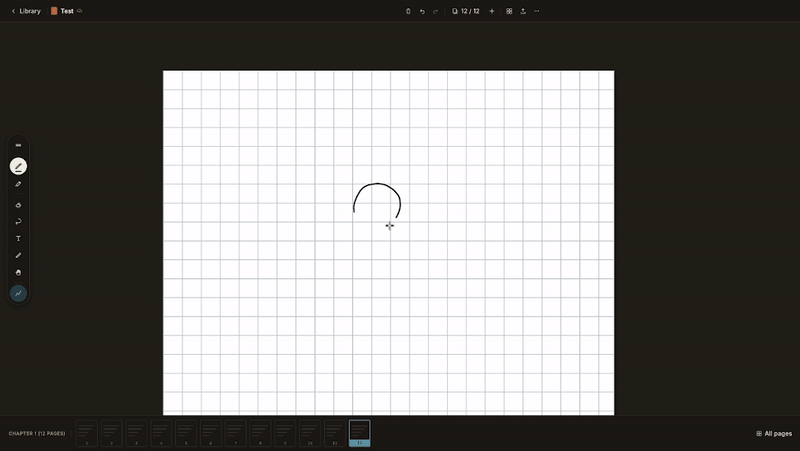
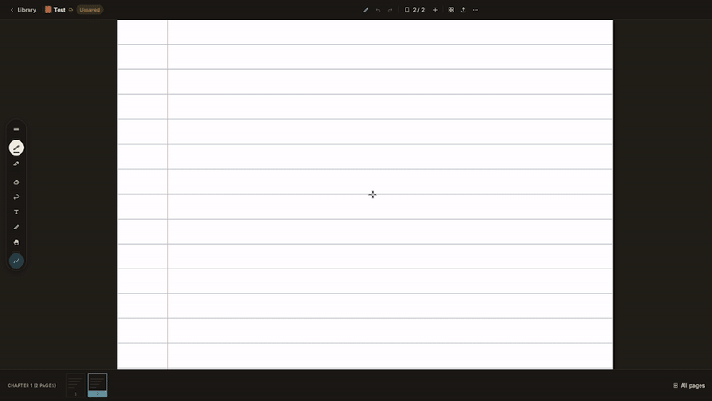

<div align="center">



# AbelNotes

**Handwritten notes for people who write equations.**
Cross-platform, self-hosted, open source. Your notes sync to *your* WebDAV server — no third-party cloud.

<!-- PLACEHOLDER:BADGES — i link si attivano dopo il primo push / le prime release -->
[](LICENSE)


</div>

---

<div align="center">

</div>

---

## Why another note-taking app?

Most handwriting apps are walled gardens: your notes live on someone else's cloud, in a format you don't control, on the platforms they decide to support. AbelNotes takes the opposite bet.

- **Your data, your server.** Sync over WebDAV to your own Nextcloud (or ownCloud). Nothing passes through a cloud we run.
- **Built for STEM.** Real LaTeX rendering, PDF annotation with selectable text, and paper types that actually matter for technical work — Cornell, isometric, music staff, and more.
- **Actually cross-platform.** Not "mobile-first, desktop-someday." Windows, Linux and Android are first-class today, with real per-platform work under the hood.
- **Open source, AGPL-3.0.** You can read exactly how your notes are handled. Build it yourself for free, or grab a store build to support development.

---

## Features

**Drawing**
- Multiple pen types — pen, ballpoint, brush, calligraphy — with pressure-driven variable stroke width
- Highlighter, lasso select, shapes with geometric snapping/recognition
- Palm rejection and stylus-only mode
- Laser pointer for presenting (not saved to the page)
- Two canvas modes: infinite "Scratch" surface and paged notebooks

<div align="center">

</div>

**For technical work**
- **LaTeX math**, rendered natively and *searchable by its source*
- **PDF import** with rasterized pages *and* selectable embedded text — annotate on top with the normal drawing tools
- **8 paper types**, including Cornell, isometric and music staff
- Symbol library for quick insertion

**Sync & offline**
- **Local-first**: everything works offline; changes sync when you reconnect
- **Delta sync**: only changed pages/assets are uploaded, not the whole notebook
- **Real conflict handling**: element-level 3-way merge, with a dedicated resolution screen when edits genuinely diverge — no silent last-write-wins
- Connection pooling tuned for real self-hosted setups (including flaky Tailscale links)

**Search**
- Full-text search across notebooks, including LaTeX sources
- Handwriting OCR search on Apple platforms (Apple Vision) <!-- gated: iOS/macOS only -->

**Import**
- Import from **OneNote**
- Import from **Obsidian** and **Notion** (Markdown-based vaults/exports) *(implemented, not yet tested against real exports)*

**Sharing**
- Read-only public links via a PDF snapshot (Nextcloud OCS Share API), with real revocation

---

## PDF import

<div align="center">

</div>

---

## Download

<!-- PLACEHOLDER:RELEASES — i link puntano alla pagina Releases una volta creata la prima release/tag -->
Grab the latest build from the [**Releases**](../../releases) page:

- **Windows** — `.exe` (unsigned for now; Windows SmartScreen will warn — *More info → Run anyway*)
- **Linux** — `.deb`, plus Flatpak *(coming soon)*
- **Android** — `.apk`, plus a Google Play closed beta *(see below)*
- **iPadOS / macOS** — working build, tested on real hardware, but not yet distributed here: an Apple Developer Program membership (paid, $100/year) is required to sign and ship builds outside Xcode. *Coming once that's set up.*


### Android beta testers wanted

The Play Store build is in closed testing. If you want in, [open an issue](../../issues) or comment on the pinned testing thread and I'll add you.

---

## Security & privacy

Short version, being honest rather than impressive:

- WebDAV connections use TLS with **certificate pinning** (trust-on-first-use) — a certificate change without re-authenticating fails the connection instead of silently trusting it.
- Your Nextcloud password is stored in the OS secure keystore (Keychain / Android Keystore / DPAPI / Secret Service), never in plain prefs.
- **Notebook content is not encrypted at rest** — it's plain JSON/ZIP, on-device and on your server. End-to-end encryption is on the roadmap, not yet built.
- Known gap: headless Linux with no Secret Service daemon falls back to storing the credential in plaintext.

Full details and known limitations: see [SECURITY.md](SECURITY.md).

---

## Building from source

<!-- PLACEHOLDER:BUILD — adatta ai comandi reali del tuo progetto (versione Flutter, ecc.) -->
Requires the [Flutter SDK](https://docs.flutter.dev/get-started/install).

```bash
git clone https://github.com/abelnotes/abelnotes.git
cd abelnotes
flutter pub get

# Run
flutter run

# Build
flutter build apk        # Android (.apk)
flutter build appbundle  # Android (.aab, for Play)
flutter build linux      # Linux
flutter build windows    # Windows
```

---

## Contributing

Contributions are welcome. By submitting a contribution, you agree to license it under AGPL-3.0 and you sign off your commits under the [Developer Certificate of Origin](https://developercertificate.org/):

```bash
git commit -s -m "your message"
```

Good first areas: testing experimental WebDAV backends against real servers (Seafile, Synology, generic WebDAV), import edge cases, and platform-specific polish.

---

## License & trademark

Source code is licensed under **AGPL-3.0-or-later** — see [LICENSE](LICENSE).

**"AbelNotes" and the AbelNotes logo are *not* covered by the AGPL license.** They are protected separately — see [TRADEMARK.md](TRADEMARK.md). In short: build and modify the code freely, but if you redistribute publicly, use a different name and icon. This mirrors common practice (e.g. Firefox/Iceweasel, Chromium/Chrome).

Third-party dependencies and their licenses are listed in [ACKNOWLEDGMENTS.md](ACKNOWLEDGMENTS.md).

---

<div align="center">
Made by Joy · <a href="https://abelnotes.app">abelnotes.app</a>
</div>
